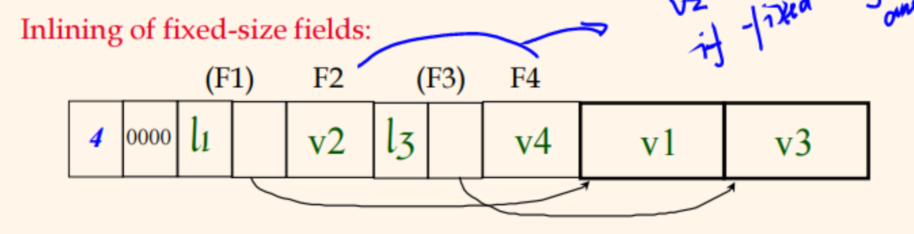

# RBF

In this folder, there are two systems: **paged file system** and **record-based file system**.

## 1. Page File System

The PF component provides facilities for higher-level client components to perform file I/O *in terms of pages*. In the PF component, methods are provided 

  - to **create**, **destroy**, **open**, and **close** paged files. (class PagedFileManager{})
  - to **read** and **write** a specific page of a given file, and to **add** pages to a given file. (class FileHandle {})

The record manager is going to be built on top of the basic paged file system.

---

> class PagedFileManager{};

The PagedFileManager class handles the creation, deletion, opening, and closing of paged files. Your program should create exactly one instance of this class, and all requests for PF component file management should be directed to that instance.

This class use to handle basic file operations.

> class FileHandle {};

The FileHandle class provides access to the pages of an open file. *To access the pages of a file, a client first creates an instance of this class and passes it to the PagedFileManager::openFile method described above.* This is important, because then the std::fstream hold the file status whether open or close.

This class is more frequently used class than the PagesFileManager(), it includes read, write, append, getNumOfPages, collectCounterValues methods to directly handle page operation.

We hard code the PAGE_SIZE to 4096, and for each file, there are three counter: readPageCounter, writePageCounter and appendPageCounter. We store these counters at the head of the file and each is 4-byte long. Then every time, when read, write or append page, the counter values should be updated (load and save again).

## 2 Record-based File System

The RecordBasedFileManager class handles record-based operations such as inserting, updating, deleting, and reading records. Your program should create exactly one instance of this class, and all requests for this component should be directed to that instance. 

> class RBFM_ScanIterator {};

Start from the head of the file, there is a attribute to store the current scanning status, and get the next record when calling getNextRecord() function.

When calling the getNextRecord(), first update the curNode which stores curSlot and curPage, if already get the end of the file, return RBFM_EOF. Then retrieve the value do the Comp, return value until we get one reasonable result.

> class RecordBasedFileManager {};

**Flag**:
- ptrFlag: current location stores a pointer which is a tombstone.
- recordFlag: current location stores actual record.

**Original input format**:
|nullIndicator: according to the num of fields|attributes(int or float is 4-bytes, for varChar, actual varChar followed by varCharLen which is 4-bytes)|. Along the input data, also there is a descriptor to describe the attribute character like, name, type, length.

**Record format**:
|flag(1)|num of fields(2)|nullIndicator: according to the num of fields|attributes(int or float is 4-bytes, for varChar, varFieldLengthLen and varFieldOffsetLen is 2-bytes, and put the actual varChar at the end.)|

**Page format**:
SlotDirectory and PageDirectory at the end of each page: 
  - SlotDirectory: store offset and length, each is 2 byte
  - PageDirectory: store numberofSlot and freespace, each is 2 byte

**insertRecord**: find the page with enough space, and insert the record, return the rid(slotNum and pageNum) indicating the location where the record stores.

**deleteRecord**: set the slot special symbol, shift the following records, change the offset of the following reset. When insert a new record, if there is a slot unused(previously deleted), first use this slot. If it is a ptr, remove it and get the value it points, until we get the actual record and delete it.

**updateRecord**: 
case 1: update record needs less space: shift the following record from the start to end and change the offset and freespace.

case2: update record needs more space: If the page is available to contain this updated recrod, shift the following record from the end to start. We can't change the RID, and rewrite the recrod corresponding to this record as a pointer, which points to the location(RID) of another page where the record is actually stored. Remember to change the free space of the new page.

